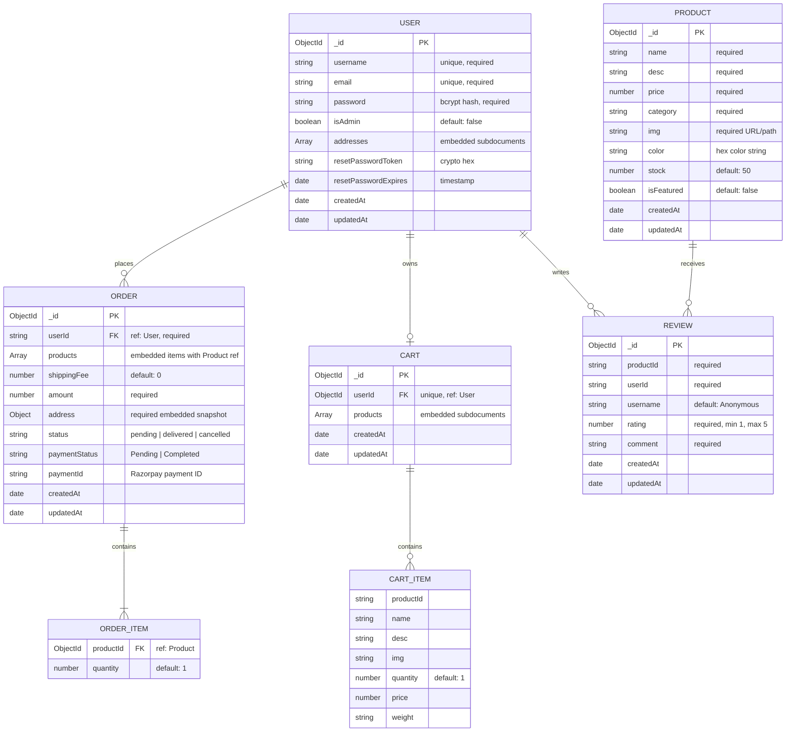
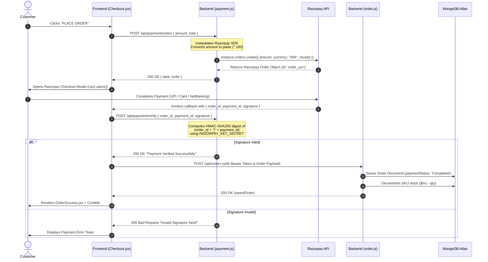
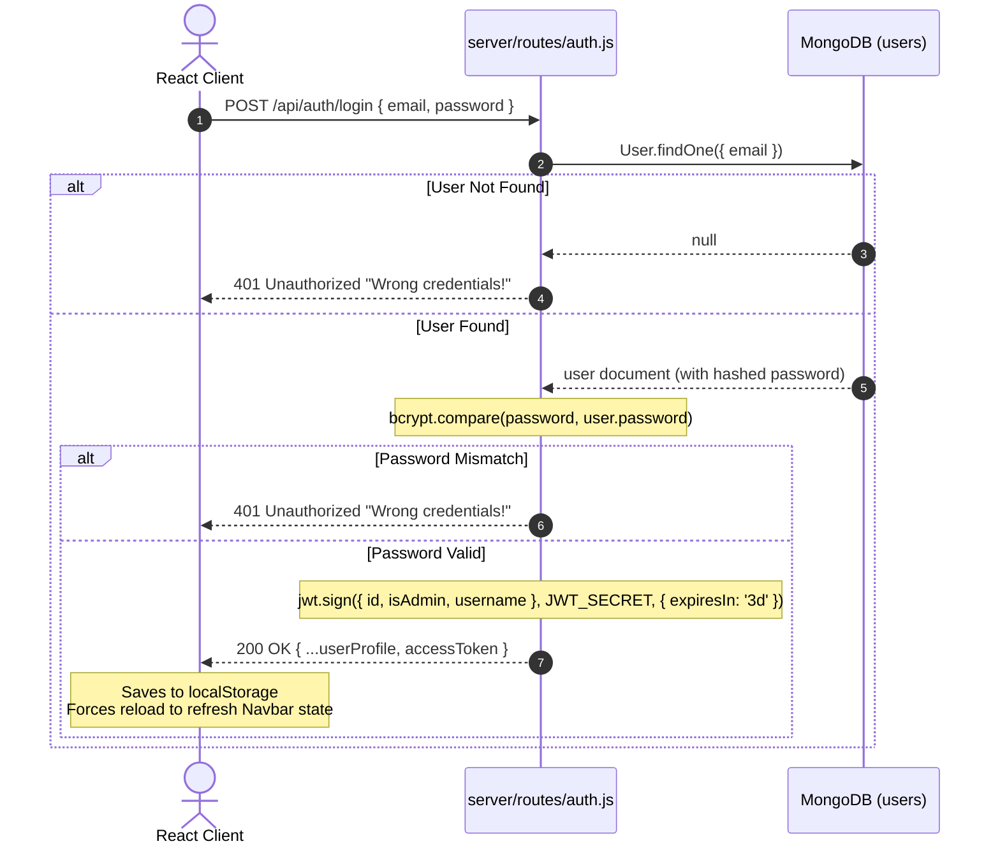
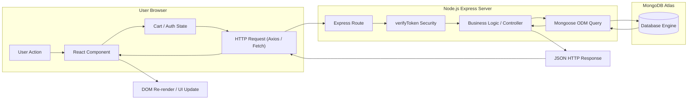
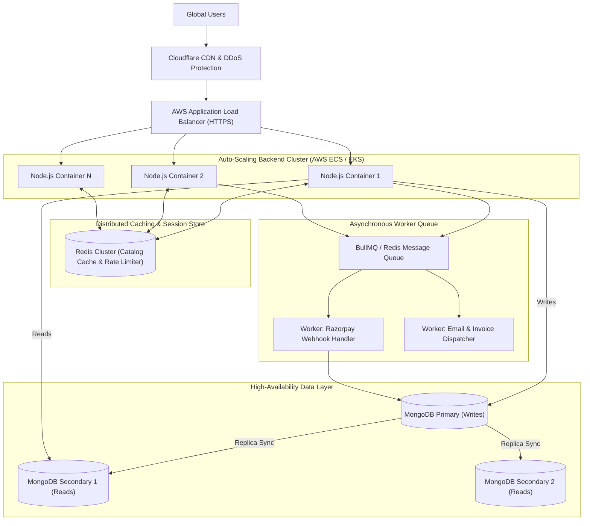

# PROJECT INTERVIEW GUIDE: TEER BRAND E-COMMERCE PLATFORM
> **Personal Technical Interview Preparation Handbook & System Architecture Manual**  
> **Target Audience:** CTO / Principal Architect Technical Interview (InsideIIM / AltUni AI Labs)  
> **Candidate:** Full Stack / AI Product Development Engineer  
> **Project Analyzed:** Teer Brand (MERN Stack + DevOps CI/CD)  
> **Repository Base:** `c:\Users\Asus\Desktop\Full_Stack\Teer_Brand_MERN`

---

## Table of Contents
1. [Project Overview](#1-project-overview)
2. [Technology Stack](#2-technology-stack)
3. [Complete Folder Structure](#3-complete-folder-structure)
4. [Important File-by-File Technical Breakdown](#4-important-file-by-file-technical-breakdown)
5. [Complete Request Flows (End-to-End Traces)](#5-complete-request-flows-end-to-end-traces)
6. [Function Call & Control Flow](#6-function-call--control-flow)
7. [Comprehensive API Documentation](#7-comprehensive-api-documentation)
8. [Database Architecture & Data Models](#8-database-architecture--data-models)
9. [Authentication & Authorization Deep Dive](#9-authentication--authorization-deep-dive)
10. [Razorpay & Payment Gateway Architecture](#10-razorpay--payment-gateway-architecture)
11. [Frontend Architecture & State Management](#11-frontend-architecture--state-management)
12. [Backend Architecture & Middleware Design](#12-backend-architecture--middleware-design)
13. [Mermaid System Architecture Diagrams](#13-mermaid-system-architecture-diagrams)
14. [Mermaid Sequence Diagrams](#14-mermaid-sequence-diagrams)
15. [Data Flow Diagrams](#15-data-flow-diagrams)
16. [Error Handling & Edge Cases](#16-error-handling--edge-cases)
17. [Security Analysis & Vulnerability Audit](#17-security-analysis--vulnerability-audit)
18. [Scalability Engineering: Current vs Production](#18-scalability-engineering-current-vs-production)
19. [Bottlenecks, Failure Points & Mitigations](#19-bottlenecks-failure-points--mitigations)
20. [“Why Did You Use This?” — Architectural Defense](#20-why-did-you-use-this--architectural-defense)
21. [“What If…” Deep CTO Scenarios & Solutions](#21-what-if-deep-cto-scenarios--solutions)
22. [Current Architecture vs Production Architecture Matrix](#22-current-architecture-vs-production-architecture-matrix)
23. [Top 20 Interview Facts (10-Minute Pre-Interview Revision)](#23-top-20-interview-facts)
24. [2-Minute Natural Pitch for the Interviewer](#24-2-minute-natural-pitch)
25. [Rapid-Fire CTO Technical Q&A (35+ Questions)](#25-rapid-fire-cto-technical-qa)

---

# 1. Project Overview

### What Teer Brand Is
**Teer Brand** is a full-stack, production-engineered Direct-to-Consumer (D2C) e-commerce platform built specifically for an Indian heritage spice and food manufacturing brand (established since 1992). The platform provides end-to-end digital retail capabilities: dynamic product cataloging across spice categories (Kitchen Essentials, Whole Spices, Salts, Blended Masalas), hybrid guest-to-authenticated cart state synchronization, pincode-based dynamic shipping tariff calculation, secure online payments via Razorpay with cryptographic HMAC-SHA256 signature verification, verified-purchase product reviews, order lifecycle management (with automatic inventory deduction and cancellation restocking), admin business intelligence dashboards with aggregation pipelines and CSV export, and a fully automated containerized DevOps CI/CD pipeline spanning GitHub Actions, Docker Hub, Jenkins, and AWS EC2.

### What Problem It Solves
Traditional FMCG and regional spice brands face challenges transitioning from offline wholesale distribution to direct online retail:
1. **Channel Disintermediation:** Eliminates distributor middlemen by giving manufacturers a direct touchpoint with consumers.
2. **Cart Continuity:** Solves cart abandonment by enabling seamless guest browsing in `localStorage` with automatic server-side MongoDB cart merge upon authentication.
3. **Tiered Logistics in India:** Automatically resolves tier-based delivery economics (free shipping thresholds and regional/national shipping surcharges driven by Indian 6-digit PIN codes).
4. **Trust & Authenticity:** Restricts product reviews strictly to verified purchasers who have an active order record for that specific SKU.
5. **Deployment Velocity:** Automates the transition from git commits to running containers via an immutable Docker build pipeline with Jenkins Continuous Deployment on AWS EC2.

### Main Features Actually Present in Codebase
* **Customer Storefront:** Dynamic showcase with custom Framer Motion & CSS parallax animations, infinite dual-row ticker banners, category filtering (`ALL`, `KITCHEN ESSENTIALS`, `SPICES`, `SALTS`, `BLENDED MASALAS`), search querying, and dynamic SKU zoom modal.
* **Hybrid Cart Engine:** React Context API state manager synchronizing guest `localStorage` items with MongoDB collection upon user authentication via custom merge routines.
* **Smart Shipping Calculator:** Client & server-side evaluation of postal PIN codes (Free for subtotal > ₹1000, ₹20 for local `825xxx`, ₹60 for regional `8xxxxx`, ₹120 standard national).
* **Payment Processing:** 2-step Razorpay order generation (in paise) and HMAC SHA-256 webhook-style signature verification.
* **Order & Inventory Tracking:** Automatic stock decrementation (`$inc: { stock: -quantity }`) on purchase, and automatic restocking (`$inc: { stock: +quantity }`) on order cancellation.
* **Verified Reviews:** RESTful review submission guarded by database queries checking whether the authenticated user has an existing order containing the target `productId`.
* **User Profile & Address Book:** Multiple address management with default address flags, profile updating, and password modification.
* **Password Reset & OTP Workflow:** Client-side OTP dispatch via EmailJS for registration and crypto hex token generation with 1-hour expiration for password recovery.
* **Admin Management Suite:** Protected admin dashboard (`/admin/*`) featuring Recharts sales analytics (7-day sales line chart, top 5 selling SKUs bar chart), CSV business report generation, real-time inventory editing, order status progression (`Pending` -> `Shipped` -> `Delivered` -> `Cancelled`), and product CRUD operations.
* **DevOps Infrastructure:** Multi-stage Dockerized backend running as an unprivileged `node` user on Node 20-alpine, automated CI in GitHub Actions, Jenkins CD pipeline pulling from Docker Hub to an AWS EC2 Ubuntu host, and Vercel edge deployment for the Vite React frontend.

### Who Interacts With It
1. **Guest Customers:** Can browse catalog, search spices, filter categories, view zoom previews, read verified reviews, and add items to a local browser cart.
2. **Registered Customers:** Can save cart items across devices, maintain multiple delivery addresses, initiate Razorpay payments, view order history with live status tags, cancel pending orders, post verified reviews, and reset passwords.
3. **Platform Administrators:** Access protected admin routes with an `isAdmin: true` JWT token to monitor total sales, view sales trend charts, update order delivery statuses, modify stock counts on-the-fly, delete items, and download CSV analytics reports.
4. **Automated Systems:** GitHub Actions CI runner building Docker images, Jenkins automation server executing shell deploys on AWS EC2, Razorpay API servers processing gateway transactions, and EmailJS dispatching notification emails.

### High-Level Architecture
```text
Browser Client (React 19 + Vite 7 SPA on Vercel CDN Edge)
   │
   ├── REST API Calls (Axios / Fetch + JWT Bearer Token Header)
   ▼
Backend Server (Node.js 20 + Express 5 in Docker Container on AWS EC2 Ubuntu)
   │
   ├── Data Persistence & Aggregations (Mongoose 9.0) ──► MongoDB Atlas Cluster
   ├── Payment Generation & Verification (Razorpay SDK + Crypto HMAC) ──► Razorpay Servers
   └── Transactional Emails (EmailJS Browser SDK) ──► EmailJS API
```

---

# 2. Technology Stack

The following technologies are **strictly based on the actual dependencies, scripts, configuration files, and imports in this repository**:

| Layer | Technology | Version (from package.json) | Where Used in Codebase | Why It Is Used |
| :--- | :--- | :--- | :--- | :--- |
| **Frontend UI Library** | `react` / `react-dom` | `^19.2.1` | `client/src/**/*.{jsx,js}` | Component-driven declarative UI rendering, virtual DOM reconciliation, and component lifecycle management. |
| **Build Tool & Bundler** | `vite` | `^7.2.4` | `client/vite.config.js`, `client/package.json` | Next-generation frontend tooling providing near-instant Hot Module Replacement (HMR) during development and optimized Rollup production builds. |
| **Frontend Routing** | `react-router-dom` | `^7.10.0` | `client/src/App.jsx`, `client/src/components/Navbar.jsx`, `client/src/pages/admin/AdminLayout.jsx` | Client-Side Routing (SPA). Supports dynamic parameters (`/product/:id`, `/reset-password/:token`), layout nesting (`PublicLayout`, `AdminLayout`), and browser history navigation. |
| **State Management** | React Context API | Native React | `client/src/context/CartContext.jsx` | Global state management for shopping cart operations, count badges, item totals, and hybrid `localStorage` / MongoDB persistence sync without heavy external state boilerplate. |
| **HTTP Client** | `axios` | `^1.13.2` | `client/src/context/CartContext.jsx`, `client/src/pages/**/*.jsx` | Promise-based HTTP client for dispatching asynchronous API requests to the Express backend with clean response handling and error intercepting. |
| **Animations** | `framer-motion` | `^12.23.26` | `client/src/pages/ContactUs.jsx`, `client/src/components/AromaAnimation.jsx`, `ProductsHero.jsx` | Declarative physics-based UI animations, floating particle effects, parallax mouse-tracking transforms, and smooth banner transitions. |
| **Data Visualization** | `recharts` | `^3.5.1` | `client/src/pages/admin/Dashboard.jsx` | Composable React charting library built on SVG elements; used to render the 7-day Sales Trend (`LineChart`) and Top 5 Selling Products (`BarChart`). |
| **UI Icons** | `lucide-react`, `react-icons` | `^0.556.0`, `^5.5.0` | Throughout `client/src/components/` & `client/src/pages/` | Lightweight vector SVG icon sets for cart badges, user profiles, truck logistics, trash actions, and navigation arrows. |
| **User Notifications** | `react-hot-toast` | `^2.6.0` | `client/src/App.jsx`, `Login.jsx`, `Register.jsx`, `Cart.jsx`, `Checkout.jsx` | Lightweight, non-blocking asynchronous toast alerts for instant UX feedback on cart additions, auth errors, and checkout status. |
| **Delight / Effects** | `react-confetti` | `^6.4.0` | `client/src/pages/OrderSuccess.jsx` | Canvas-based celebratory particle burst rendered upon successful payment capture and database order commit. |
| **Client Email Service** | `@emailjs/browser` | `^4.4.1` | `client/src/pages/Register.jsx`, `ForgotPassword.jsx`, `Checkout.jsx` | Direct client-to-email service dispatching OTP verification codes, password reset links, and HTML order invoices without requiring SMTP server maintenance. |
| **Backend Runtime** | `Node.js` | `v20.x` (Alpine) | `server/server.js`, `server/Dockerfile` | Asynchronous, event-driven JavaScript runtime executing server-side non-blocking I/O operations and hosting the Express REST API. |
| **Web Framework** | `express` | `^5.2.1` | `server/server.js`, `server/routes/*.js` | Fast, unopinionated minimalist web framework providing HTTP request routing, middleware composition, JSON body parsing, and route parameter extraction. |
| **Database ODM** | `mongoose` | `^9.0.0` | `server/models/*.js`, `server/server.js`, `server/seed.js` | Object Data Modeling (ODM) library for MongoDB; enforces structured schemas, data validation, default values, references (`ref`), and MongoDB aggregation pipelines. |
| **Database Engine** | MongoDB Atlas | Cloud NoSQL Cluster | Defined in `server/.env` via `MONGO_URI` | Document-oriented distributed NoSQL database providing high write throughput, JSON-native BSON storage, flexible subdocuments (embedded addresses), and aggregation frameworks. |
| **Password Hashing** | `bcryptjs` | `^3.0.3` | `server/routes/auth.js`, `server/routes/user.js` | One-way cryptographic adaptive hashing algorithm utilizing configurable salt rounds (10) to secure user passwords against rainbow table and brute-force attacks. |
| **Authentication & Tokens** | `jsonwebtoken` | `^9.0.2` | `server/routes/auth.js`, `server/middleware/verifyToken.js` | Implements RFC 7519 JSON Web Tokens (JWT) for stateless, digitally signed user session management with 3-day expiration claims. |
| **Payment Gateway SDK** | `razorpay` | `^2.9.6` | `server/routes/payment.js`, `client/src/pages/Checkout.jsx` | Official SDK for creating server-side payment orders in INR paise and integrating client-side checkout modal with callback verification. |
| **CORS Middleware** | `cors` | `^2.8.5` | `server/server.js` | Express middleware to enable Cross-Origin Resource Sharing, allowing the Vercel-hosted frontend domain to make API requests to the backend server. |
| **Environment Configuration** | `dotenv` | `^17.2.3` | `server/server.js`, `server/seed.js` | Zero-dependency module that loads environment variables from a `.env` file into Node.js `process.env`. |
| **Cryptographic Utilities** | `crypto` | Native Node.js module | `server/routes/auth.js`, `server/routes/payment.js` | Generates secure pseudo-random bytes for password reset tokens and computes HMAC SHA-256 digests to cryptographically verify Razorpay payment signatures. |
| **Containerization** | `Docker` | `node:20-alpine` | `server/Dockerfile`, `server/.dockerignore` | Packages the backend application into an isolated, lightweight container image ensuring consistent runtime behavior across local, CI, and production environments. |
| **Continuous Integration** | GitHub Actions | `v4` / `v3` actions | `.github/workflows/backend-ci.yml` | Cloud CI automation that triggers on every push to `main`, builds the backend Docker container, pushes to Docker Hub, and invokes the Jenkins deployment webhook. |
| **Continuous Deployment** | `Jenkins` | Declarative Pipeline (`Jenkinsfile`) | `Jenkinsfile` (EC2 hosted) | Orchestrates automated deployment on AWS EC2: pulls latest Docker image, stops/removes stale container, spins up updated container with restart policies, and prunes unused images. |
| **Cloud Hosting & Compute** | `AWS EC2` (Ubuntu Server) | LTS Linux | Referenced in `README.md`, `Jenkinsfile`, `.github/workflows/backend-ci.yml` | Cloud compute virtual machine hosting the Jenkins CI/CD instance and running the backend Docker container daemon on port 5000. |
| **Edge Hosting** | `Vercel` | Serverless Global CDN | `client/vercel.json` | Global edge hosting platform serving the compiled React frontend SPA with rewrite rules directing all paths to `index.html`. |

---

# 3. Complete Folder Structure

```text
Teer_Brand_MERN/
├── .git/                                   # Git version control metadata
├── .github/
│   └── workflows/
│       └── backend-ci.yml                  # GitHub Actions CI workflow (Docker build & Jenkins trigger)
├── .gitignore                              # Root git ignore rules
├── Jenkinsfile                             # Declarative Jenkins CD pipeline for EC2 deployment
├── README.md                               # Project documentation & DevOps deployment manual
├── steps.md                                # DevOps setup command logs & execution steps
├── flask_interview_prep/                   # *Supplementary interview practice scripts*
│   ├── flask_mongo_demo.py                 # (Practice: Flask + PyMongo + JWT Auth demo)
│   ├── flask_sql_demo.py                   # (Practice: Flask + SQLAlchemy demo)
│   └── flask_sql_practise.py               # (Practice: Flask SQL practice script)
├── server/                                 # BACKEND ROOT (Node.js + Express 5)
│   ├── .dockerignore                       # Files excluded from Docker build context
│   ├── .env                                # Backend environment secrets (PORT, MONGO_URI, JWT_SECRET, etc.)
│   ├── Dockerfile                          # Multi-stage Docker packaging configuration (node:20-alpine)
│   ├── docker_instructions.md              # Container build & run instruction cheatsheet
│   ├── package.json                        # Backend manifest, scripts, and production dependencies
│   ├── package-lock.json                   # Deterministic dependency lockfile
│   ├── seed.js                             # Database seeder (clears and populates 12 default spice products)
│   ├── server.js                           # Backend entry point, middleware registration, DB connect & route mounts
│   ├── middleware/
│   │   └── verifyToken.js                  # JWT Authentication & RBAC Authorization middleware
│   ├── models/
│   │   ├── Cart.js                         # Mongoose Schema for User Cart and item subdocuments
│   │   ├── Order.js                        # Mongoose Schema for Orders, shipping, payment info & references
│   │   ├── Product.js                      # Mongoose Schema for Spices catalog, inventory & pricing
│   │   ├── Review.js                       # Mongoose Schema for Verified Customer Ratings & Comments
│   │   └── User.js                         # Mongoose Schema for User credentials, addresses & reset tokens
│   └── routes/
│       ├── auth.js                         # Auth routes: register, login, forgot-password, reset-password
│       ├── cart.js                         # Cart routes: add, update_qty, merge, get, remove, clear
│       ├── interview.js                    # (Scratch test route snippet)
│       ├── order.js                        # Order routes: create (with shipping & stock dec), user orders, cancel, admin CRUD
│       ├── payment.js                      # Razorpay routes: create order (paise) & verify HMAC signature
│       ├── products.js                     # Product routes: public get/filter, admin CRUD, verified purchase reviews
│       ├── stats.js                        # Admin stats route: MongoDB aggregation for revenue, 7-day sales & top products
│       └── user.js                         # User routes: profile update, address add/delete, admin user lookup
└── client/                                 # FRONTEND ROOT (React 19 + Vite 7 SPA)
    ├── .env                                # Frontend environment variables (VITE_API_BASE_URL, Razorpay Key, EmailJS keys)
    ├── .gitignore                          # Frontend git ignore rules
    ├── eslint.config.js                    # ESLint configuration
    ├── frontend_viva_guide.md              # Frontend viva and hooks conceptual guide
    ├── index.html                          # Single Page Application HTML entry point & viewport meta
    ├── package.json                        # Frontend manifest, scripts (dev, build, preview), dependencies
    ├── package-lock.json                   # Frontend dependency lockfile
    ├── vercel.json                         # Vercel SPA routing rewrite rules (`/(.*)` -> `/index.html`)
    ├── vite.config.js                      # Vite build configuration with React plugin
    ├── public/
    │   └── images/                         # Static assets (brand logos, spice pack images, animated banners)
    └── src/
        ├── App.css                         # App-level styling rules
        ├── App.jsx                         # Main React router configuration, provider wrappers & route tree
        ├── index.css                       # Comprehensive global stylesheet (45KB+ containing theme tokens, cards, grids)
        ├── main.jsx                        # React 19 root bootstrap (`createRoot` with `StrictMode`)
        ├── assets/                         # Static SVG / images imported into components
        ├── components/
        │   ├── AromaAnimation.css          # Styling for rising spice aroma particles
        │   ├── AromaAnimation.jsx          # Framer Motion rising aroma particles component
        │   ├── CountUp.jsx                 # Animated numeric counter component using `useRef` & `useEffect`
        │   ├── Footer.jsx                  # Global footer with brand info, site map, and copyright
        │   ├── HeroAnimation.jsx           # Animated interactive hero banner for landing page
        │   ├── Loader.jsx                  # Reusable SVG/CSS loading spinner component
        │   ├── Navbar.css                  # Styles for desktop navbar, dropdowns, and mobile slide drawer
        │   ├── Navbar.jsx                  # Global header with dynamic auth menu, cart counter, and category links
        │   ├── ProductsHero.css            # Styles for falling spices hero banner
        │   ├── ProductsHero.jsx            # Framer Motion falling spice animation banner
        │   ├── PublicLayout.jsx            # Layout wrapper embedding `<Navbar />`, `<Outlet />`, and `<Footer />`
        │   └── ScrollToTop.jsx             # Route change listener resetting window scroll position to (0,0)
        ├── context/
        │   └── CartContext.jsx             # React Context Provider managing hybrid local/DB cart operations
        └── pages/
            ├── Auth.css / AuthStyles.css   # Styling for auth cards, inputs, and OTP inputs
            ├── Cart.jsx                    # Shopping cart page with line items, quantity modifiers, and subtotal
            ├── Checkout.css / Checkout.jsx # Multi-step checkout, PIN shipping calculation, Razorpay execution
            ├── ContactUs.css / ContactUs.jsx # Contact page with interactive parallax mouse-tracking and Google Maps iframe
            ├── ForgotPassword.jsx          # Password reset request page (generates crypto token + EmailJS dispatch)
            ├── Home.jsx                    # Brand landing page with slide animations, brand story, and product previews
            ├── Login.jsx                   # User login form storing JWT token and user profile in `localStorage`
            ├── MyOrders.css / MyOrders.jsx # Customer order history, item breakdowns, delivery snapshots, and cancel actions
            ├── OnlineStore.css / OnlineStore.jsx # D2C shop page with search, category filtering, and direct add-to-cart
            ├── OrderSuccess.jsx            # Post-purchase confetti celebration page with links to orders/home
            ├── ProductDetails.css / ProductDetails.jsx # Detailed SKU view, stock check, star rating, and verified reviews
            ├── ProductGallery.jsx          # Interactive product showcase with infinite 3-row scroller and zoom modal
            ├── Register.jsx                # New user registration with client-side 6-digit OTP verification via EmailJS
            ├── ResetPassword.jsx           # Set new password page validating crypto token against backend
            ├── UserProfile.css / UserProfile.jsx # Account dashboard for profile updating and address book management
            ├── WhoWeAre.css / WhoWeAre.jsx # Brand heritage page detailing manufacturing history and quality standards
            └── admin/                      # ADMIN CONTROL PANEL
                ├── admin.css               # Comprehensive dashboard, sidebar, table, and form styles
                ├── AdminLayout.jsx         # Admin shell with responsive sidebar, top navbar, and route guard
                ├── AdminLogin.jsx          # Admin authentication portal checking `isAdmin: true` claim
                ├── Dashboard.jsx           # Analytics hub with Recharts line/bar graphs and CSV report exporter
                ├── EditProduct.jsx         # Admin product editor form updating SKU price, desc, and category
                ├── NewProduct.jsx          # Admin product creation form with color picker and stock initialization
                ├── Orders.jsx              # Admin order fulfillment table with dynamic status dropdown selector
                └── Products.jsx            # Admin product inventory table with live inline stock count editing
```

---

# 4. Important File-by-File Technical Breakdown

### `server/server.js`
* **Purpose:** The central entry point for the Node.js/Express backend application.
* **Why It Exists:** Bootstraps Express, loads environment variables, configures core global middleware (`express.json`, `cors`), connects to MongoDB Atlas via Mongoose, mounts all REST route modules under `/api/*`, and binds the server to the configured network port.
* **Important Imports:** `express`, `mongoose`, `dotenv`, `cors`, and route handlers from `./routes/*`.
* **Important Logic:**
  * `dotenv.config()` loads secrets before any other module executes.
  * `app.use(express.json())` parses incoming `application/json` HTTP bodies into `req.body`.
  * `app.use(cors())` sets `Access-Control-Allow-Origin: *` to unblock Vercel cross-origin AJAX requests.
  * `mongoose.connect(process.env.MONGO_URI)` initializes asynchronous connection pooling to MongoDB Atlas.
  * Route mounting: `/api/auth`, `/api/users`, `/api/products`, `/api/orders`, `/api/cart`, `/api/payment`, `/api/stats`.
  * `app.listen(PORT, ...)` opens the TCP socket on port 5000 (or `process.env.PORT`).

```text
Incoming HTTP Request (Port 5000)
      ↓
cors() Middleware ──► express.json() Middleware
      ↓
Route Dispatcher (/api/auth, /api/products, /api/orders, etc.)
      ↓
Specific Route Handler
```

---

### `server/middleware/verifyToken.js`
* **Purpose:** Implements multi-tier JSON Web Token (JWT) authentication and Role-Based Access Control (RBAC).
* **Why It Exists:** Protects sensitive backend endpoints from unauthenticated access, enforces resource ownership, and restricts privileged actions to administrators.
* **Key Functions:**
  1. `verifyToken(req, res, next)`:
     * Reads `req.headers.token`.
     * Extracts token via `authHeader.split(" ")[1]` (strips `Bearer ` prefix).
     * Invokes `jwt.verify(token, process.env.JWT_SECRET)`.
     * On success, attaches decoded payload `{ id, isAdmin, username }` to `req.user` and calls `next()`.
     * On failure, returns `403 Forbidden` ("Token is not valid!") or `401 Unauthorized` ("You are not authenticated!").
  2. `verifyTokenAndAuthorization(req, res, next)`:
     * Chained wrapper around `verifyToken`.
     * Evaluates ownership: `req.user.id === req.params.id || req.user.id === req.params.userId || req.user.isAdmin`.
     * Grants access if the requesting user owns the resource or is an admin; otherwise returns `403`.
  3. `verifyTokenAndAdmin(req, res, next)`:
     * Chained wrapper around `verifyToken`.
     * Evaluates: `if (req.user.isAdmin) next(); else res.status(403)`.

---

### `server/routes/auth.js`
* **Purpose:** Handles the identity lifecycle: user registration, login credential verification, JWT issuance, and two-step tokenized password recovery.
* **Key Endpoints:**
  * `POST /register`: Checks duplicate email (`User.findOne({ email })`), generates salt (`bcrypt.genSalt(10)`), hashes password (`bcrypt.hash`), creates and persists `new User(...)`. Returns `201 Created`.
  * `POST /login`: Finds user by email, verifies password via `bcrypt.compare(req.body.password, user.password)`. On success, signs a JWT using `jwt.sign({ id: user._id, isAdmin: user.isAdmin, username: user.username }, JWT_SECRET, { expiresIn: "3d" })`. Strips password hash from document (`const { password, ...others } = user._doc`) and returns user profile + `accessToken`.
  * `POST /forgot-password-init`: Locates user by email, generates a 20-byte random hex string via native `crypto.randomBytes(20).toString('hex')`, stores `resetPasswordToken` and `resetPasswordExpires = Date.now() + 3600000` (1 hour) on the user document, and returns the token and username to the frontend for EmailJS delivery.
  * `POST /reset-password-finish`: Finds user with matching token and valid expiry (`resetPasswordExpires: { $gt: Date.now() }`). Hashes the new password, clears the reset fields (`resetPasswordToken = undefined`), and saves the document.

---

### `server/routes/payment.js`
* **Purpose:** Facilitates secure online payments via the Razorpay API.
* **Key Endpoints:**
  * `POST /orders`: Instantiates `new Razorpay({ key_id, key_secret })`. Calculates amount in the smallest currency unit: `amount: req.body.amount * 100` (paise). Generates a random receipt ID (`crypto.randomBytes(10).toString("hex")`). Calls `instance.orders.create(...)` and returns the official Razorpay Order object (`{ id: "order_xyz", amount, currency }`) to the client.
  * `POST /verify`: Performs cryptographic validation of payment completion. Extracts `razorpay_order_id`, `razorpay_payment_id`, and `razorpay_signature` from `req.body`. Reconstructs digest input string: `sign = razorpay_order_id + "|" + razorpay_payment_id`. Generates HMAC digest:
    ```javascript
    const expectedSign = crypto
      .createHmac("sha256", process.env.RAZORPAY_KEY_SECRET)
      .update(sign.toString())
      .digest("hex");
    ```
    Compares `razorpay_signature === expectedSign`. If matched, responds with `200 OK` ("Payment Verified Successfully"); otherwise `400 Bad Request` ("Invalid Signature Sent!").

---

### `server/routes/order.js`
* **Purpose:** Manages the entire lifecycle of customer orders: creation with pincode-based shipping tariffs, atomic inventory deduction, customer order history retrieval, customer order cancellation with stock replenishment, and admin order management.
* **Key Endpoints:**
  * `POST /` (`verifyToken`):
    * **Shipping Tariff Rule:** Evaluates `req.body.address.pincode`. If `amount > 1000`, `shippingFee = 0`. Else if PIN starts with `825`, `shippingFee = 20`. Else if PIN starts with `8`, `shippingFee = 60`. Else default `shippingFee = 120`. Updates `req.body.amount = currentAmount + shippingFee`.
    * **Order Persistence:** Saves `new Order(req.body)`.
    * **Stock Decrement:** Iterates over `req.body.products` and executes `Product.findByIdAndUpdate(item.productId, { $inc: { stock: -item.quantity } })`.
  * `GET /find/:userId` (`verifyTokenAndAuthorization`): Queries `Order.find({ userId }).populate("products.productId")` to return user order history with populated product images, titles, and prices.
  * `PUT /:id/cancel` (`verifyToken`): Validates that the requesting user owns the order or is an admin, and checks that `order.status === "pending"`. Sets `order.status = "cancelled"`, saves order, and iterates over products executing `Product.findByIdAndUpdate(item.productId, { $inc: { stock: item.quantity } })` to restore inventory.
  * `PUT /:id` (`verifyTokenAndAdmin`): Updates order delivery status (`Pending` -> `Shipped` -> `Delivered`).
  * `GET /` (`verifyTokenAndAdmin`): Retrieves all platform orders with populated user credentials for the admin dashboard.

---

### `server/routes/stats.js`
* **Purpose:** Powers the admin business intelligence dashboard via advanced MongoDB aggregation pipelines.
* **Key Endpoint:** `GET /` (`verifyTokenAndAdmin`):
  * Counts documents: `Product.countDocuments()`, `Order.countDocuments()`.
  * Computes Total Revenue excluding cancelled orders:
    ```javascript
    Order.aggregate([
      { $match: { status: { $ne: "cancelled" } } },
      { $group: { _id: null, total: { $sum: "$amount" } } }
    ]);
    ```
  * Computes 7-Day Sales Trend:
    ```javascript
    Order.aggregate([
      { $match: { createdAt: { $gte: last7Days }, status: { $ne: "cancelled" } } },
      { $project: { day: { $dateToString: { format: "%d-%m", date: "$createdAt" } }, amount: "$amount" } },
      { $group: { _id: "$day", sales: { $sum: "$amount" } } },
      { $sort: { _id: 1 } }
    ]);
    ```
  * Computes Top 5 Best-Selling Products:
    ```javascript
    Order.aggregate([
      { $match: { status: { $ne: "cancelled" } } },
      { $unwind: "$products" },
      { $addFields: { "products.productId": { $toObjectId: "$products.productId" } } },
      { $group: { _id: "$products.productId", totalSold: { $sum: "$products.quantity" } } },
      { $sort: { totalSold: -1 } },
      { $limit: 5 },
      { $lookup: { from: "products", localField: "_id", foreignField: "_id", as: "productInfo" } },
      { $project: { name: { $ifNull: [{ $arrayElemAt: ["$productInfo.name", 0] }, "Unknown Product"] }, totalSold: 1 } }
    ]);
    ```

---

### `client/src/context/CartContext.jsx`
* **Purpose:** The global state engine managing cart operations across the entire React application.
* **Why It Exists:** Unifies guest shopping (stored in browser `localStorage`) with authenticated user shopping (persisted in MongoDB `Cart` collection), providing real-time item count badges and price totals to all components.
* **Key Logic & Functions:**
  * `useEffect` on Mount: Checks if user is logged in. If logged in and guest items exist in `localStorage`, dispatches `POST /api/cart` with `type: 'merge'` to combine guest items into the database, then fetches the unified cart via `GET /api/cart/find/:userId`. If guest, reads `cartItems` from `localStorage`.
  * `addToCart(product)`: If authenticated, makes `POST /api/cart` (`type: 'add'`); if guest, updates local state array and writes to `localStorage`.
  * `removeFromCart(id)`: Dispatches `POST /api/cart/remove` for authenticated users; filters local state for guests.
  * `updateQuantity(id, type)`: Calculates increment/decrement and syncs via `POST /api/cart` (`type: 'update_qty'`).
  * `getCartTotal()` / `getCartCount()`: Array reducers computing total sum (`item.price * item.quantity`) and total unit count.
  * `clearCart()`: Empties state and dispatches `POST /api/cart/clear` to database.

---

### `client/src/pages/Checkout.jsx`
* **Purpose:** Orchestrates user shipping details input, live pincode shipping tariff estimation, Razorpay checkout modal activation, cryptographic verification callback, database order creation, and confirmation email dispatch.
* **Key Functions:**
  * `useEffect` [pincode, subtotal]: Recalculates `shippingCost` in real-time as user types their postal code (Rule: Free if subtotal > ₹1000; ₹20 for `825xxx`; ₹60 for `8xxxxx`; ₹120 standard).
  * `handleSubmit`:
    1. Validates form inputs (Name, 10-digit Phone, Address, City, 6-digit PIN).
    2. Sends `POST /api/payment/orders` with `{ amount: total }` to get Razorpay `order_id`.
    3. Initializes `new window.Razorpay(options)` with Razorpay Public Key, Order ID, and customer prefill details.
    4. In Razorpay `handler(response)` callback:
       - Sends `POST /api/payment/verify` with `{ razorpay_order_id, razorpay_payment_id, razorpay_signature }`.
       - If verified, calls `saveOrderToDB(...)`.
  * `saveOrderToDB`: Calls `POST /api/orders` attaching `Bearer ${token}` and payload (cart items, subtotal amount, shipping address, `paymentStatus: "Completed"`, `paymentId`). Calls `sendConfirmationEmail(userData)`, calls `clearCart()`, and navigates to `/order-success`.

---

# 5. COMPLETE REQUEST FLOWS (End-to-End Traces)

---

### Flow 1: User Registration with Email OTP Verification
```text
User fills Username, Email, Password on Register.jsx
        ↓
Clicks "SEND OTP"
        ↓
Register.jsx generates 6-digit random code: Math.floor(100000 + Math.random() * 900000)
        ↓
Sets expiry in state: Date.now() + 15 * 60 * 1000 (15 minutes)
        ↓
Calls emailjs.send(SERVICE_ID, TEMPLATE_ID, { to_email, passcode, time })
        ↓
EmailJS dispatches OTP to user's inbox
        ↓
User enters 6-digit OTP and clicks "VERIFY & REGISTER"
        ↓
Frontend validates otp === generatedOtp and Date.now() <= otpExpiry
        ↓
Dispatches HTTP POST /api/auth/register with { username, email, password }
        ↓
Express routes to server/routes/auth.js (router.post('/register'))
        ↓
Mongoose executes User.findOne({ email }) ──► Database Check
        ↓
bcrypt.genSalt(10) + bcrypt.hash(password, salt) ──► Generates 60-char hash
        ↓
new User({ username, email, password: hashedPassword, isAdmin: false }).save()
        ↓
MongoDB inserts document into 'users' collection
        ↓
Backend returns 201 Created with savedUser
        ↓
React receives response, displays toast.success("Registration Successful!"), navigates to /login
```

---

### Flow 2: User Login & JWT Issuance
```text
User inputs Email & Password on Login.jsx
        ↓
Clicks "LOGIN" (triggers handleLogin)
        ↓
Dispatches HTTP POST /api/auth/login with { email, password }
        ↓
Express routes to server/routes/auth.js (router.post('/login'))
        ↓
User.findOne({ email }) queries MongoDB 'users' collection
        ↓
If found, bcrypt.compare(req.body.password, user.password) compares plaintext with hash
        ↓
If matched, jwt.sign({ id: user._id, isAdmin: user.isAdmin, username: user.username }, JWT_SECRET, { expiresIn: '3d' })
        ↓
Destructures: const { password, ...others } = user._doc
        ↓
Backend responds 200 OK with { ...others, accessToken }
        ↓
Frontend executes: localStorage.setItem("user", JSON.stringify(res.data))
        ↓
window.location.replace("/") forces reload, refreshing Navbar auth state & mounting CartContext sync
```

---

### Flow 3: Hybrid Cart Synchronization (Guest to Authenticated)
```text
Guest adds spices to cart on OnlineStore.jsx / ProductGallery.jsx
        ↓
CartContext.jsx stores items in localStorage under key 'cartItems'
        ↓
User logs in and visits site (CartContext useEffect mounts)
        ↓
CartContext detects user._id in localStorage AND localCart.length > 0
        ↓
Dispatches HTTP POST /api/cart with { userId, product: localCart, type: 'merge' }
        ↓
Express routes to server/routes/cart.js
        ↓
Cart.findOne({ userId }) locates existing user cart in MongoDB
        ↓
Iterates localCart: checks if item exists in cart.products; if not, pushes item subdocument
        ↓
cart.save() commits updated document to 'carts' collection in MongoDB
        ↓
Frontend removes 'cartItems' from localStorage
        ↓
Dispatches HTTP GET /api/cart/find/:userId to load unified cart into React state
        ↓
UI renders unified cart badge and items seamlessly
```

---

### Flow 4: End-to-End Checkout, Pincode Logistics & Razorpay Payment
```text
User navigates to /checkout and enters delivery address & PIN code (e.g. 825409)
        ↓
Checkout.jsx useEffect evaluates PIN: startsWith("825") ──► Sets shippingCost = ₹20
        ↓
User clicks "PLACE ORDER"
        ↓
Step 1: Create Razorpay Order
        ↓
Frontend calls HTTP POST /api/payment/orders with { amount: total }
        ↓
Server routes to server/routes/payment.js
        ↓
Instantiates new Razorpay({ key_id, key_secret })
        ↓
Calls instance.orders.create({ amount: total * 100, currency: "INR", receipt: randomHex })
        ↓
Razorpay API creates order and returns order_id (e.g., 'order_NX123abc')
        ↓
Server responds 200 OK with { data: order }
        ↓
Step 2: Razorpay Client Modal
        ↓
Checkout.jsx instantiates new window.Razorpay(options) and calls rzp1.open()
        ↓
Razorpay overlay opens; user completes payment (UPI / Card / NetBanking)
        ↓
Razorpay modal invokes handler({ razorpay_order_id, razorpay_payment_id, razorpay_signature })
        ↓
Step 3: Signature Verification
        ↓
Frontend calls HTTP POST /api/payment/verify with signature payload
        ↓
Server generates expected HMAC-SHA256 digest: crypto.createHmac("sha256", SECRET).update(order_id + "|" + payment_id).digest("hex")
        ↓
Compares signature === expectedSign ──► Responds 200 OK ("Payment Verified Successfully")
        ↓
Step 4: Database Order Save & Stock Decrement
        ↓
Frontend calls HTTP POST /api/orders with Headers: { token: "Bearer <accessToken>" }
Payload: { userId, products, amount: subtotal, address, paymentStatus: "Completed", paymentId }
        ↓
verifyToken middleware authenticates JWT
        ↓
Server recalculates shippingFee based on PIN and updates total amount
        ↓
new Order(req.body).save() persists order document in 'orders' collection
        ↓
Server loops over items: Product.findByIdAndUpdate(item.productId, { $inc: { stock: -item.quantity } })
        ↓
Server responds 200 OK with savedOrder
        ↓
Frontend fires sendConfirmationEmail() via EmailJS, calls clearCart(), navigates to /order-success
        ↓
OrderSuccess.jsx renders celebratory confetti burst (<Confetti />)
```

---

### Flow 5: Order Cancellation & Inventory Restock
```text
Customer navigates to /orders (MyOrders.jsx)
        ↓
MyOrders.jsx calls GET /api/orders/find/:userId with Bearer Token
        ↓
Renders list of user orders with status badges
        ↓
User clicks "Cancel" on a 'pending' order
        ↓
Dispatches HTTP PUT /api/orders/:id/cancel with Bearer Token
        ↓
Express routes to server/routes/order.js (router.put('/:id/cancel'))
        ↓
verifyToken middleware extracts req.user
        ↓
Order.findById(req.params.id) retrieves order from MongoDB
        ↓
Security Check: Asserts req.user.isAdmin || order.userId === req.user.id
        ↓
State Check: Asserts order.status === "pending"
        ↓
Sets order.status = "cancelled" and calls order.save()
        ↓
Restock Loop:
for (const item of order.products) {
  Product.findByIdAndUpdate(item.productId, { $inc: { stock: item.quantity } });
}
        ↓
Server responds 200 OK with { message: "Order cancelled and items restocked", order }
        ↓
Frontend updates local orders state, replacing status badge with 'CANCELLED'
```

---

### Flow 6: Verified Purchase Review Submission
```text
Customer views ProductDetails.jsx (/product/:id)
        ↓
Selects Star Rating (1-5) and enters review comment
        ↓
Clicks "Submit Review"
        ↓
Dispatches HTTP POST /api/products/:id/reviews with Bearer Token & { rating, comment }
        ↓
Express routes to server/routes/products.js
        ↓
verifyToken middleware extracts req.user.id
        ↓
Verification Step 1: Order.find({ userId: req.user.id })
Iterates through all customer orders to check if order.products contains productId
If not found, immediately aborts with 403 Forbidden ("You must purchase this product to leave a review.")
        ↓
Verification Step 2: Review.findOne({ userId, productId })
If existing review found, aborts with 400 Bad Request ("You have already reviewed this product.")
        ↓
Creates new Review({ userId, productId, username, rating, comment }).save()
        ↓
MongoDB inserts document into 'reviews' collection
        ↓
Server responds 201 Created with savedReview
        ↓
React appends new review to reviews list and displays toast.success("Review submitted successfully!")
```

---

### Flow 7: Admin Analytics Aggregation
```text
Admin navigates to /admin/dashboard (Dashboard.jsx)
        ↓
AdminLayout.jsx asserts user.isAdmin === true; redirects to /admin/login if false
        ↓
Dashboard.jsx calls HTTP GET /api/stats with Headers: { token: `Bearer ${user.accessToken}` }
        ↓
verifyTokenAndAdmin middleware verifies JWT and asserts req.user.isAdmin === true
        ↓
Express routes to server/routes/stats.js
        ↓
Executes parallel MongoDB Aggregations:
1. Total revenue sum ($match non-cancelled, $group total)
2. 7-day sales breakdown ($match >= last7Days, $dateToString "%d-%m", $group by day)
3. Top 5 selling SKUs ($unwind products, $group sum quantity, $sort -1, $limit 5, $lookup products)
        ↓
Server responds 200 OK with { totalProducts, totalOrders, totalRevenue, salesStats, topProducts }
        ↓
React renders key metric KPI cards, Recharts <LineChart /> for daily sales, and <BarChart /> for top products
        ↓
Admin clicks "Download Report" ──► Client-side CSV encoded data URI generated and downloaded
```

---

# 6. FUNCTION CALL / CONTROL FLOW

### A. Trace: Product Review Submission
```text
Client: ProductDetails.jsx
  └─ handleSubmitReview(e)
       ├─ Reads localStorage.getItem('user')
       └─ axios.post('/api/products/:id/reviews', { rating, comment }, { headers: { token } })
             │
             ▼ [Network HTTP POST]
Server: server/routes/products.js
  └─ router.post('/:id/reviews', verifyToken, async (req, res))
       ├─ verifyToken.js: verifyToken(req, res, next)
       │    └─ jwt.verify(token, JWT_SECRET) ──► Sets req.user
       ├─ Order.find({ userId: req.user.id })
       │    └─ Mongoose query on 'orders' collection
       ├─ Array.some() check on order.products for matching productId
       ├─ Review.findOne({ userId, productId })
       ├─ User.findById(userId) (Fallback for username)
       ├─ new Review({ ... }).save()
       │    └─ MongoDB Insert operation
       └─ res.status(201).json(savedReview)
             │
             ▼ [HTTP 201 Response]
Client: ProductDetails.jsx
  └─ setReviews([res.data, ...reviews]) ──► React DOM re-render
```

### B. Trace: Checkout & Order Placement
```text
Client: Checkout.jsx
  └─ handleSubmit(e)
       ├─ validateForm()
       ├─ fetch('/api/payment/orders', { method: 'POST', body: { amount: total } })
       │     │
       │     ▼
       │   Server: server/routes/payment.js -> Razorpay instance.orders.create(...)
       │     │
       │     ▼ [Returns Razorpay order_id]
       ├─ new window.Razorpay(options).open()
       └─ Razorpay handler callback executes:
            ├─ fetch('/api/payment/verify', { method: 'POST', body: { ...signatures } })
            │     │
            │     ▼
            │   Server: crypto.createHmac("sha256", SECRET) comparison
            │     │
            │     ▼ [Returns 200 OK Verified]
            └─ saveOrderToDB(userId, token, paymentId, userData, subtotal)
                  ├─ fetch('/api/orders', { method: 'POST', headers: { token }, body: orderPayload })
                  │     │
                  │     ▼
                  │   Server: server/routes/order.js -> verifyToken()
                  │     ├─ Pincode tariff calculation
                  │     ├─ new Order(req.body).save() ──► MongoDB Insert
                  │     ├─ Loop: Product.findByIdAndUpdate(id, { $inc: { stock: -qty } })
                  │     └─ res.status(200).json(savedOrder)
                  │
                  ├─ sendConfirmationEmail(userData) ──► emailjs.send(...)
                  ├─ clearCart() ──► CartContext clearCart()
                  └─ navigate('/order-success')
```

---

# 7. COMPREHENSIVE API DOCUMENTATION

| Method | Endpoint | Source File | Handler / Middleware | Purpose | Authentication | Request Body / Params | Response Structure |
| :--- | :--- | :--- | :--- | :--- | :--- | :--- | :--- |
| **POST** | `/api/auth/register` | `server/routes/auth.js` | Anonymous route handler | Register new user account | Public | `{ username, email, password }` | `201`: User Document |
| **POST** | `/api/auth/login` | `server/routes/auth.js` | Anonymous route handler | Authenticate user & issue JWT | Public | `{ email, password }` | `200`: `{ _id, username, email, isAdmin, addresses, accessToken }` |
| **POST** | `/api/auth/forgot-password-init` | `server/routes/auth.js` | Anonymous route handler | Generate 1-hr reset crypto token | Public | `{ email }` | `200`: `{ status: "ok", token, username }` |
| **POST** | `/api/auth/reset-password-finish` | `server/routes/auth.js` | Anonymous route handler | Hash & save new password | Public | `{ token, newPassword }` | `200`: `"Password reset successful!"` |
| **PUT** | `/api/users/:id` | `server/routes/user.js` | `verifyTokenAndAuthorization` | Update username/password | Owner / Admin | Param: `id`, Body: `{ username, password, ... }` | `200`: Updated User Document |
| **PUT** | `/api/users/:id/address` | `server/routes/user.js` | `verifyTokenAndAuthorization` | Add delivery address | Owner / Admin | Param: `id`, Body: `{ street, city, state, pin, isDefault }` | `200`: Updated User with addresses |
| **DELETE** | `/api/users/:id/address/:addressId`| `server/routes/user.js` | `verifyTokenAndAuthorization` | Remove delivery address | Owner / Admin | Params: `id`, `addressId` | `200`: `"Address deleted"` |
| **GET** | `/api/users/find/:id` | `server/routes/user.js` | `verifyTokenAndAuthorization` | Get user profile & addresses | Owner / Admin | Param: `id` | `200`: User object (sans password) |
| **GET** | `/api/products` | `server/routes/products.js` | Anonymous route handler | Fetch all spices or filter by category | Public | Query: `?category=SPICES` | `200`: `Product[]` |
| **GET** | `/api/products/find/:id`| `server/routes/products.js` | Anonymous route handler | Get single spice SKU details | Public | Param: `id` | `200`: Product Document |
| **POST** | `/api/products` | `server/routes/products.js` | `verifyTokenAndAdmin` | Create new spice SKU | Admin Only | Body: `{ name, desc, price, category, img, color, stock }` | `200`: Created Product Document |
| **PUT** | `/api/products/:id` | `server/routes/products.js` | `verifyTokenAndAdmin` | Update SKU price, stock, details | Admin Only | Param: `id`, Body: partial/full product | `200`: Updated Product Document |
| **DELETE** | `/api/products/:id` | `server/routes/products.js` | `verifyTokenAndAdmin` | Remove spice SKU | Admin Only | Param: `id` | `200`: `"Product has been deleted..."` |
| **POST** | `/api/products/:id/reviews` | `server/routes/products.js` | `verifyToken` | Post verified purchase review | Verified Buyer | Param: `id`, Body: `{ rating, comment }` | `201`: Created Review Document |
| **GET** | `/api/products/:id/reviews` | `server/routes/products.js` | Anonymous route handler | Get reviews for a spice SKU | Public | Param: `id` | `200`: `Review[]` sorted by `createdAt: -1` |
| **POST** | `/api/cart` | `server/routes/cart.js` | Anonymous route handler | Add, update qty, or merge cart | Public / User | Body: `{ userId, product, type }` | `200`: Saved Cart Document |
| **GET** | `/api/cart/find/:userId` | `server/routes/cart.js` | Anonymous route handler | Get user's persistent cart | Public / User | Param: `userId` | `200`: Cart Document |
| **POST** | `/api/cart/remove` | `server/routes/cart.js` | Anonymous route handler | Remove product from cart | Public / User | Body: `{ userId, productId }` | `200`: Updated Cart Document |
| **POST** | `/api/cart/clear` | `server/routes/cart.js` | Anonymous route handler | Empty user cart | Public / User | Body: `{ userId }` | `200`: `"Cart cleared"` |
| **POST** | `/api/payment/orders` | `server/routes/payment.js` | Anonymous route handler | Create Razorpay Order instance | Public | Body: `{ amount }` (in INR) | `200`: `{ data: RazorpayOrder }` |
| **POST** | `/api/payment/verify` | `server/routes/payment.js` | Anonymous route handler | Verify HMAC SHA-256 signature | Public | Body: `{ razorpay_order_id, razorpay_payment_id, razorpay_signature }` | `200`: `{ message: "Payment Verified Successfully" }` |
| **POST** | `/api/orders` | `server/routes/order.js` | `verifyToken` | Create order, calc PIN shipping, dec stock | Authenticated User | Body: `{ userId, products, amount, address, paymentStatus, paymentId }` | `200`: Saved Order Document |
| **GET** | `/api/orders/find/:userId` | `server/routes/order.js` | `verifyTokenAndAuthorization` | Get user order history | Owner / Admin | Param: `userId` | `200`: `Order[]` (populated with product info) |
| **PUT** | `/api/orders/:id/cancel` | `server/routes/order.js` | `verifyToken` | Cancel pending order & restock | Owner / Admin | Param: `id` | `200`: `{ message, order }` |
| **GET** | `/api/orders` | `server/routes/order.js` | `verifyTokenAndAdmin` | Get all platform orders | Admin Only | None | `200`: `Order[]` (populated with user info) |
| **PUT** | `/api/orders/:id` | `server/routes/order.js` | `verifyTokenAndAdmin` | Update order status | Admin Only | Param: `id`, Body: `{ status }` | `200`: Updated Order Document |
| **GET** | `/api/stats` | `server/routes/stats.js` | `verifyTokenAndAdmin` | Aggregated analytics & revenue | Admin Only | None | `200`: `{ totalProducts, totalOrders, totalRevenue, salesStats, topProducts }` |

---

# 8. DATABASE ARCHITECTURE

### Database Engine & Connection
* **Technology:** MongoDB Atlas (Cloud NoSQL) managed via Mongoose 9.0 ODM.
* **Connection Lifecycle:** Established in `server/server.js` via `mongoose.connect(process.env.MONGO_URI)` with connection event logging (`DB Connection Successful!`).

### Collection Schemas & Data Structures



### Schema Design Patterns Explained
1. **Hybrid Embedded vs Referenced Data:**
   * **Cart Model:** Embeds product details (`name`, `img`, `price`, `weight`) directly inside the `products` array so that viewing the cart requires zero database `$lookup` joins, maximizing read speed.
   * **Order Model:** Stores `productId` as a reference (`ref: 'Product'`) with embedded snapshots of shipping address and quantity, enabling historical order population via `.populate("products.productId")`.
2. **Atomic Modifiers:** Inventory manipulation relies on MongoDB's atomic `$inc` operators (`$inc: { stock: -quantity }` and `$inc: { stock: quantity }`), eliminating read-modify-write race conditions.
3. **Compound Aggregations:** Admin analytics leverage MongoDB's native aggregation pipeline (`$match`, `$project`, `$group`, `$sort`, `$unwind`, `$lookup`) to compute multi-metric reports directly in database memory.

---

# 9. AUTHENTICATION AND AUTHORIZATION

### Authentication Mechanism
1. **Password Hashing:**
   * Uses `bcryptjs` with 10 salt rounds (`bcrypt.genSalt(10)`).
   * Plaintext passwords never touch database storage.
2. **Stateless JWT Tokens:**
   * Signed with `jsonwebtoken` using HMAC-SHA256 (`process.env.JWT_SECRET`).
   * Payload: `{ id: user._id, isAdmin: user.isAdmin, username: user.username }`.
   * Token expiration: Set to `3d` (3 days).
3. **Client-Side Storage:**
   * Stored in browser `localStorage` under the key `"user"`.
   * Structure: JSON serialized object containing profile details and `accessToken`.
4. **Authorization Header Convention:**
   * Client transmits the token inside HTTP headers:
     `headers: { token: 'Bearer ' + user.accessToken }`
   * Middleware extracts and verifies: `const token = req.headers.token.split(" ")[1]`.

### Role-Based Access Control (RBAC)
```text
Request Arrives at Endpoint
          ↓
[verifyToken Middleware]
  ├─ Validates JWT signature & expiry
  ├─ Attaches decoded payload to req.user
  └─ Calls next()
          ↓
[Authorization Layer]
  ├─ Level 1: Public Routes (No middleware)
  │    └─ GET /api/products, POST /api/auth/login, etc.
  ├─ Level 2: verifyToken (Authenticated User)
  │    └─ POST /api/orders, POST /api/products/:id/reviews, PUT /api/orders/:id/cancel
  ├─ Level 3: verifyTokenAndAuthorization (Owner or Admin)
  │    └─ Asserts: req.user.id === req.params.id || req.user.id === req.params.userId || req.user.isAdmin
  │    └─ Used on: User profile updates, address management, user order history
  └─ Level 4: verifyTokenAndAdmin (Admin Only)
       └─ Asserts: req.user.isAdmin === true
       └─ Used on: Product CRUD, admin order list, order status modification, analytics stats
```

### Password Recovery Security
* **Token Generation:** Uses Node.js native `crypto.randomBytes(20).toString('hex')`.
* **Database TTL:** Token stored with `resetPasswordExpires = Date.now() + 3600000` (1-hour window).
* **Single Use Guarantee:** Immediately clears `user.resetPasswordToken = undefined` and `user.resetPasswordExpires = undefined` upon successful password reset.

### Security Weaknesses & Gaps in Current Implementation
> [!WARNING]
> 1. **Token in `localStorage`:** Vulnerable to Cross-Site Scripting (XSS) extraction. In production, JWTs should be stored in `httpOnly`, `secure`, `sameSite: 'strict'` cookies.  
> 2. **Client-Side OTP Generation in Registration:** `Register.jsx` generates the OTP on the client (`Math.random()`) and calls EmailJS directly from the browser. A malicious user could inspect network traffic, bypass verification, or spoof OTP checks. In production, OTPs must be generated, stored, and verified strictly on the backend.  
> 3. **Non-Standard Auth Header:** Uses `req.headers.token` instead of the RFC standard `Authorization: Bearer <token>`.

---

# 10. RAZORPAY / PAYMENT ARCHITECTURE

### Razorpay Integration Flow
The payment integration uses a secure 2-step verification protocol combining the official Razorpay Node.js SDK and client-side Razorpay Checkout modal.



### Key Razorpay Implementation Details
1. **Server Initialization:**
   `new Razorpay({ key_id: process.env.RAZORPAY_KEY_ID, key_secret: process.env.RAZORPAY_KEY_SECRET })` initialized per request to avoid global instance startup crashes if env variables are missing.
2. **Smallest Unit Calculation:** Amount multiplied by 100 (`req.body.amount * 100`) because Indian Rupee transactions in Razorpay operate in paise.
3. **Cryptographic Verification Algorithm:**
   ```javascript
   const sign = razorpay_order_id + "|" + razorpay_payment_id;
   const expectedSign = crypto
       .createHmac("sha256", process.env.RAZORPAY_KEY_SECRET)
       .update(sign.toString())
       .digest("hex");
   const isMatch = (razorpay_signature === expectedSign);
   ```

---

# 11. FRONTEND ARCHITECTURE

### Architecture Overview
* **Core:** React 19 Single Page Application (SPA) initialized via Vite 7.
* **Component Hierarchies:**
  * `App.jsx` orchestrates routing with `react-router-dom` v7.
  * `PublicLayout.jsx`: Wraps all consumer-facing pages with `<Navbar />` (dynamic authentication status, category dropdowns, cart count badge) and `<Footer />`.
  * `AdminLayout.jsx`: Dedicated control room with collapsable sidebar navigation, top bar, and role guards.
  * `<ScrollToTop />`: Automatically resets window scroll to `(0, 0)` on route transitions.
  * `<Toaster />`: Top-center notification manager from `react-hot-toast`.

### State Management: Hybrid Cart Context
```text
                ┌──────────────────────────────────────┐
                │          CartContext.jsx             │
                └──────────────────┬───────────────────┘
                                   │
              ┌────────────────────┴────────────────────┐
              ▼                                         ▼
   [Guest Mode: !user]                       [Authenticated Mode: user]
   - Reads from localStorage                 - Fetches from GET /api/cart/find/:userId
   - Writes to localStorage                  - Dispatches POST /api/cart (add/update/remove)
   - Zero network latency                    - Cross-device database persistence
              │                                         │
              └───────────────► LOGIN ◄─────────────────┘
                                  │
                  POST /api/cart { type: 'merge' }
                  Merges localStorage items into DB
```

---

# 12. BACKEND ARCHITECTURE

### Design Pattern
* **Framework:** Express 5.2 running on Node.js 20.
* **Structure:** Route-Controller-Model architecture with inline route controllers.
* **Middleware Chain:**
  1. `cors()`: Cross-Origin Resource Sharing enablement.
  2. `express.json()`: Stream body parser.
  3. `verifyToken` / `verifyTokenAndAuthorization` / `verifyTokenAndAdmin`: Security gates.
  4. Mongoose Data Layer: Interfacing with MongoDB Atlas.

```text
HTTP Request
     │
     ▼
[cors()] ──► [express.json()] ──► [Route Handler] ──► [verifyToken Middleware]
                                                            │
                                                            ▼
                                                     [Mongoose Model]
                                                            │
                                                            ▼
                                                     [MongoDB Atlas]
```

---

# 13. MERMAID SYSTEM ARCHITECTURE DIAGRAMS

```mermaid
flowchart TB
    subgraph ClientTier ["Frontend Tier (Vercel Edge CDN)"]
        ReactApp["React 19 + Vite SPA"]
        Context["CartContext (State Engine)"]
        Router["React Router v7"]
        ReactApp --> Context
        ReactApp --> Router
    end

    subgraph ExternalServices ["External Cloud Services"]
        RazorpayGateway["Razorpay Payment Gateway"]
        EmailJSService["EmailJS API (OTP & Invoices)"]
    end

    subgraph BackendTier ["Backend Tier (AWS EC2 / Docker Container)"]
        ExpressServer["Express 5.2 Server (Port 5000)"]
        AuthMiddleware["verifyToken RBAC Middleware"]
        AuthRoute["/api/auth"]
        ProductRoute["/api/products"]
        CartRoute["/api/cart"]
        OrderRoute["/api/orders"]
        PaymentRoute["/api/payment"]
        StatsRoute["/api/stats"]
        UserRoute["/api/users"]

        ExpressServer --> AuthMiddleware
        ExpressServer --> AuthRoute
        ExpressServer --> ProductRoute
        ExpressServer --> CartRoute
        ExpressServer --> OrderRoute
        ExpressServer --> PaymentRoute
        ExpressServer --> StatsRoute
        ExpressServer --> UserRoute
    end

    subgraph DataTier ["Data Tier (MongoDB Atlas Cloud Cluster)"]
        MongoDB[("MongoDB Atlas")]
        UsersColl[("users")]
        ProductsColl[("products")]
        CartsColl[("carts")]
        OrdersColl[("orders")]
        ReviewsColl[("reviews")]

        MongoDB --- UsersColl
        MongoDB --- ProductsColl
        MongoDB --- CartsColl
        MongoDB --- OrdersColl
        MongoDB --- ReviewsColl
    end

    subgraph DevOpsPipeline ["DevOps CI/CD Pipeline"]
        GitHub["GitHub Repository (main branch)"]
        GHActions["GitHub Actions CI Runner"]
        DockerHub["Docker Hub (theshreshth/teer-brand-backend)"]
        Jenkins["Jenkins CD Server (AWS EC2 :8080)"]

        GitHub -->|git push| GHActions
        GHActions -->|Build & Push Image| DockerHub
        GHActions -->|Trigger Webhook| Jenkins
        Jenkins -->|Pull & Deploy Container| BackendTier
    end

    ReactApp -->|REST API Calls (Axios)| ExpressServer
    ReactApp -->|Direct OTP & Emails| EmailJSService
    ReactApp -->|Client Checkout Modal| RazorpayGateway
    PaymentRoute -->|Create Orders & HMAC Verification| RazorpayGateway
    BackendTier -->|Mongoose 9.0 ODM Queries & Aggregations| MongoDB
```

---

# 14. MERMAID SEQUENCE DIAGRAMS

### Authentication Sequence


---

# 15. DATA FLOW DIAGRAMS



---

# 16. ERROR HANDLING

### Current Error Handling Implementation
1. **Backend Route Wrapping:** Every route handler is wrapped in a `try/catch` block.
2. **HTTP Status Code Conventions:**
   * `200 OK` / `201 Created`: Successful operations.
   * `400 Bad Request`: Validation failures, duplicate reviews, non-pending cancellations, invalid HMAC signatures.
   * `401 Unauthorized`: Missing authentication token, invalid login credentials.
   * `403 Forbidden`: Token invalid/expired, role permission check failed, unverified purchase review attempt.
   * `404 Not Found`: Target user, cart, product, or order ID not found in database.
   * `500 Internal Server Error`: Unhandled database or server runtime exceptions (returns `res.status(500).json(err)`).
3. **Frontend Feedback:** React components use `react-hot-toast` (`toast.error(...)`) and window alert fallbacks to provide clear visual feedback to the user on error states.
4. **Image Fallback Handling:** Broken image links in `Cart.jsx` are caught via `onError` event listeners and gracefully replaced with inline SVG data placeholders.

---

# 17. SECURITY

### Implemented Security Features
* **Password Salting & Hashing:** One-way adaptive cryptographic hashing with `bcryptjs` (salt factor 10).
* **Cryptographic Signatures:** Razorpay payment verification uses HMAC SHA-256 with server-side private secret.
* **Role-Based Access Control:** Three-tier authorization middleware (`verifyToken`, `verifyTokenAndAuthorization`, `verifyTokenAndAdmin`).
* **Non-Root Docker Execution:** The Dockerfile specifies `USER node` and `chown -R node:node`, preventing root container privilege escalation attacks.
* **Environment Secret Segregation:** All sensitive database URIs, JWT secrets, and payment API keys are kept strictly in `.env` files and injected via Jenkins credentials in CI/CD.

### Potential Security Improvements (What to tell the CTO)
1. **Centralized Input Validation:** Introduce `express-validator` or `zod` schemas on routes to sanitize incoming strings and prevent NoSQL injection via malicious operator payloads (`{ "$gt": "" }`).
2. **Cookie-Based Sessions:** Migrate JWT storage from `localStorage` to `httpOnly`, `secure`, `sameSite: 'strict'` cookies to eliminate XSS token theft.
3. **Rate Limiting:** Integrate `express-rate-limit` to protect `/api/auth/login`, `/register`, and `/forgot-password-init` against brute-force credential stuffing and email flooding.
4. **CORS Hardening:** Replace open `cors()` with a whitelist restricted strictly to `https://teerbrand.vercel.app`.
5. **Helmet Security Headers:** Add `helmet` middleware to set `Content-Security-Policy`, `X-Frame-Options: DENY`, and `X-Content-Type-Options: nosniff`.

---

# 18. SCALABILITY — VERY IMPORTANT FOR INTERVIEW

### Limitations of Current Architecture
* **Single Node Express Instance:** Deployed as a single container instance on one EC2 virtual machine, creating a single point of failure (SPOF) and vertical scale ceiling.
* **Direct Database Dependency:** Every product query hits MongoDB Atlas directly; high traffic on the storefront causes database connection exhaustion.
* **Coupled Email & Inventory Workflows:** Email dispatching and inventory modifications happen synchronously in request lifecycles rather than through background message queues.

### Production Scaling Roadmap (What to explain to the CTO)



1. **Horizontal Scaling:** Deploy the backend across multiple containers using AWS ECS / Kubernetes behind an AWS Application Load Balancer with health checks on `/`.
2. **Redis In-Memory Caching:** Cache product catalog queries (`/api/products`) with TTL invalidation on admin edits (`POST/PUT/DELETE /api/products`), reducing database read traffic by up to 90%.
3. **Asynchronous Task Queues:** Offload order confirmation emails, invoice generation, and SMS notifications to a Redis-backed queue (`BullMQ`) processed by background worker processes.
4. **Idempotent Webhooks for Payments:** Rather than relying on client callbacks, configure Razorpay Webhooks (`payment.captured`, `order.paid`) processed by worker queues with idempotency keys.
5. **Database Optimization:** Configure compound indexes (e.g. `{ category: 1, price: 1 }` on `products`, `{ userId: 1, createdAt: -1 }` on `orders`), implement connection pooling, and route read queries to MongoDB Atlas read-replicas.

---

# 19. BOTTLENECKS AND FAILURE POINTS

### 1. Two-Step Client-Side Payment Verification & Order Save
* **Problem:** If a user closes their browser or loses network connection immediately after Razorpay succeeds but before `saveOrderToDB` completes, the user is charged but no order is created in MongoDB.
* **Impact:** Customer money deducted without an order confirmation; requires manual customer support reconciliation.
* **Production Solution:** Implement Razorpay Server Webhooks listening to `payment.captured` events that create or finalize orders asynchronously on the server regardless of client state.

### 2. Race Conditions on Product Stock Decrement
* **Problem:** Stock is decremented in a `for` loop across products using `$inc`. If multiple concurrent orders request the last remaining unit of an SKU, both orders may proceed, resulting in negative stock.
* **Impact:** Overselling inventory.
* **Production Solution:** Enforce MongoDB conditional updates (`Product.findOneAndUpdate({ _id: id, stock: { $gte: quantity } }, { $inc: { stock: -quantity } })`) wrapped inside a multi-document ACID transaction (`session.withTransaction(...)`).

### 3. In-Memory Aggregations on Unindexed Collections
* **Problem:** The `stats.js` endpoint executes `$unwind`, string-to-ObjectId type conversions (`$toObjectId`), and `$lookup` joins on the entire `orders` collection without index constraints.
* **Impact:** As order volume grows to tens of thousands, dashboard response times will degrade significantly.
* **Production Solution:** Create an index on `orders.createdAt` and `orders.status`, store pre-aggregated daily summaries in a separate `daily_stats` collection, and use native `ObjectId` types consistently for `productId` fields.

---

# 20. “WHY DID YOU USE THIS?” QUESTIONS

### “Why React instead of Next.js or Vanilla JS?”
> “For Teer Brand’s dynamic single-page storefront and admin management suite, React 19 provided the ideal balance of component modularity, rich ecosystem support (Framer Motion, Recharts, Lucide), and instant client-side reactivity. Because our primary SEO focus is centered on high-converting product showcases and rapid checkout interactions, pairing Vite with React enabled instant HMR during development and sub-second page transitions via client-side routing on Vercel’s edge CDN.”

### “Why Node.js & Express instead of Python / Django / Spring Boot?”
> “Node.js and Express provide an asynchronous, non-blocking I/O runtime that is naturally suited for high-concurrency I/O-bound e-commerce workloads—such as streaming JSON catalogs, handling parallel payment callbacks, and executing database aggregations. Writing the backend in JavaScript also allows full-stack language uniformity across React and Express, streamlining schema design and data validation models.”

### “Why MongoDB instead of PostgreSQL / MySQL?”
> “Teer Brand’s catalog features diverse product attributes, color codes, variable package weights, and embedded user address books that map naturally to document-based BSON structures. Furthermore, embedding subdocuments inside carts and orders allowed us to execute single-document atomic operations without the overhead of heavy relational joins during high-frequency cart updates.”

### “Why JWT instead of Session Cookies?”
> “JWT enables a completely stateless authentication architecture. Because the token contains the verified user claims (`id`, `isAdmin`) signed with a cryptographic secret, the backend does not need to query a session database or memory store on every API call. This makes the backend trivial to scale horizontally behind a load balancer without configuring sticky sessions.”

### “Why Razorpay instead of Stripe?”
> “Razorpay is the market-leading payment gateway in India, offering native support for UPI apps (Google Pay, PhonePe, Paytm), domestic debit/credit cards, and net banking with localized rupee settlement and automatic HMAC-SHA256 signature verification.”

### “Why Docker, Jenkins & GitHub Actions for Deployment?”
> “Containerizing the Express application with Docker ensures complete environment parity between development and production. GitHub Actions handles the Continuous Integration (CI) stage by building and pushing immutable images to Docker Hub on every commit to `main`, while Jenkins on AWS EC2 provides Continuous Deployment (CD) by automatically pulling the latest image and executing a zero-downtime container rollover.”

---

# 21. “WHAT IF…” INTERVIEW QUESTIONS

### Q1: “What if 10,000 users place an order simultaneously during a flash sale?”
> **Answer:** “In the current single-container architecture, the server would hit CPU/memory saturation and MongoDB connection limits. To handle 10,000 concurrent orders:
> 1. We scale the backend horizontally into multiple Node.js containers across an ECS cluster behind an AWS Application Load Balancer.
> 2. We place Redis in front of the product catalog for sub-millisecond cached reads.
> 3. We use MongoDB atomic conditional updates (`{ _id: id, stock: { $gte: qty } }`) inside ACID transactions to prevent overselling.
> 4. Order creation tasks and notification emails are pushed to a Redis-backed BullMQ message queue to smooth out write traffic.”

### Q2: “What if MongoDB goes down while users are browsing or checking out?”
> **Answer:** “Currently, requests would throw unhandled 500 errors. In production:
> 1. MongoDB Atlas is deployed as a Multi-AZ Replica Set with automated failover from primary to secondary within seconds.
> 2. Mongoose connection pooling is configured with retry logic (`retryWrites=true`).
> 3. Read requests for the storefront are served from a distributed Redis cache, allowing users to continue browsing product details even during temporary database failovers.”

### Q3: “What if the user’s payment succeeds in Razorpay, but their browser crashes before reaching your backend?”
> **Answer:** “This is the fundamental limitation of client-side payment callbacks. To solve this in production, we configure Razorpay Server Webhooks. Razorpay sends an asynchronous `payment.captured` POST request directly to our backend server. A webhook handler verifies the signature, creates or updates the order document in MongoDB, and triggers email notifications independently of the user's browser.”

### Q4: “What if an attacker steals a user’s JWT token?”
> **Answer:** “Because JWTs are stateless, a stolen token remains valid until its 3-day expiration. To mitigate this:
> 1. Reduce access token lifetime to 15 minutes and implement refresh tokens stored in `httpOnly` secure cookies with token rotation.
> 2. Store a token version or blacklist in Redis to enable immediate token revocation on password change or logout.
> 3. Enforce HTTPS across all endpoints to prevent packet sniffing on untrusted networks.”

### Q5: “What if two customers buy the last jar of Turmeric Powder at the exact same millisecond?”
> **Answer:** “We replace the current loop update with an atomic conditional query:
> ```javascript
> const updated = await Product.findOneAndUpdate(
>   { _id: productId, stock: { $gte: quantity } },
>   { $inc: { stock: -quantity } },
>   { new: true }
> );
> if (!updated) throw new Error('Insufficient inventory');
> ```
> The first atomic operation decrements stock to 0 and succeeds; the second operation finds `stock: 0` (failing `{ $gte: 1 }`), returns `null`, and triggers an out-of-stock rollback.”

---

# 22. CURRENT ARCHITECTURE VS PRODUCTION ARCHITECTURE

| Feature Area | Current Repository Implementation | Production Enterprise Architecture |
| :--- | :--- | :--- |
| **Compute & Hosting** | Single Node.js Docker container on one AWS EC2 instance | Auto-scaling container cluster (AWS ECS / Kubernetes) behind AWS ALB |
| **API Caching** | Direct database queries on every route invocation | Distributed Redis caching layer for catalog items with TTL invalidation |
| **Database Setup** | Single MongoDB Atlas URI connection string | MongoDB Atlas Replica Set with automated failover & read-preference routing |
| **Payment Finalization**| Client-driven callback triggering `saveOrderToDB` | Server-to-server Razorpay Webhooks (`payment.captured`) with idempotency keys |
| **Inventory Concurrency**| Sequential `$inc` updates in a loop without transactions | Atomic conditional updates (`stock: { $gte: qty }`) in Mongo ACID sessions |
| **Cart Persistence** | Hybrid React Context + `localStorage` / DB merge | Redis session cart store synced asynchronously with MongoDB |
| **Auth Token Storage** | `localStorage` with `req.headers.token` Bearer string | `httpOnly`, `secure`, `sameSite: strict` cookies with refresh token rotation |
| **OTP Verification** | Client-side `Math.random()` OTP via EmailJS | Backend-generated cryptographically secure OTP stored in Redis with TTL |
| **Static Imagery** | Static image files served from `/public/images` | AWS S3 Object Storage + CloudFront Global CDN with image optimization |
| **Logging & Monitoring**| `console.log` statements in routes | Structured logging (Winston), APM (Datadog/NewRelic), and Prometheus/Grafana |

---

# 23. TOP 20 THINGS I MUST REMEMBER

1. **Architecture:** Teer Brand is a MERN e-commerce platform with a Vite React 19 frontend on Vercel and a Dockerized Express 5.2 backend on AWS EC2.
2. **Entry Point:** `server/server.js` initializes Express, CORS, JSON parsing, MongoDB Atlas connection, and mounts 7 REST routes under `/api/*`.
3. **Database Models:** 5 Mongoose schemas: `User`, `Product`, `Cart`, `Order`, `Review`.
4. **Auth Middleware:** `server/middleware/verifyToken.js` provides 3 levels: `verifyToken`, `verifyTokenAndAuthorization` (owner/admin), and `verifyTokenAndAdmin`.
5. **Auth Tokens:** Uses JWT signed with `JWT_SECRET` expiring in 3 days; payload contains `{ id, isAdmin, username }`.
6. **Password Security:** Uses `bcryptjs` with 10 salt rounds (`bcrypt.genSalt(10)`); passwords are never returned in responses (`const { password, ...others } = user._doc`).
7. **Password Reset:** `POST /api/auth/forgot-password-init` generates a 20-byte crypto hex token with 1-hour expiration; reset happens at `POST /api/auth/reset-password-finish`.
8. **Cart Synchronization:** `CartContext.jsx` manages hybrid state: guest cart in `localStorage`, unified with database via `POST /api/cart` (`type: 'merge'`) upon login.
9. **Shipping Tariff Rule:** Calculated dynamically on PIN code: Free if amount > ₹1000; ₹20 if PIN starts with `825` (local); ₹60 if PIN starts with `8` (regional); ₹120 default (national).
10. **Razorpay Order Creation:** `POST /api/payment/orders` converts amount to paise (`* 100`) and calls `instance.orders.create(...)` with a random receipt hex.
11. **Razorpay Verification:** `POST /api/payment/verify` uses HMAC SHA-256 (`crypto.createHmac("sha256", SECRET).update(order_id + "|" + payment_id).digest("hex")`) to verify signatures.
12. **Inventory Management:** Creating an order executes atomic stock decrement (`$inc: { stock: -quantity }`); cancelling an order executes restock (`$inc: { stock: quantity }`).
13. **Verified Reviews:** `POST /api/products/:id/reviews` verifies that the requesting user has an active order containing the target `productId` before accepting the review.
14. **Admin Analytics:** `GET /api/stats` executes MongoDB aggregation pipelines (`$match`, `$project`, `$group`, `$sort`, `$unwind`, `$lookup`) to compute revenue, 7-day sales, and top 5 SKUs.
15. **Data Visualization:** Admin dashboard uses `recharts` to render `<LineChart />` (Sales Trends) and `<BarChart />` (Top Products), with dynamic CSV report export.
16. **Animations:** Uses `framer-motion` for floating aromas (`AromaAnimation.jsx`), falling spices (`ProductsHero.jsx`), and mouse-tracking parallax (`ContactUs.jsx`).
17. **Docker Security:** `server/Dockerfile` uses `node:20-alpine`, `npm ci --omit=dev`, and runs as the non-root `USER node` on port 5000.
18. **CI Pipeline:** `.github/workflows/backend-ci.yml` builds the Docker image on push to `main`, pushes to Docker Hub, and triggers Jenkins via a webhook curl.
19. **CD Pipeline:** `Jenkinsfile` on AWS EC2 pulls the latest image, stops/removes old container, launches new container with injected credentials, and prunes unused images.
20. **Key Bottleneck:** Two-step payment verification vs order saving on client; production fix is server-to-server Razorpay Webhooks.

---

# 24. 2-MINUTE NATURAL PITCH

> *"Teer Brand is a production-ready D2C e-commerce platform I built for a heritage Indian spice brand. I architected the full stack using the MERN stack—React 19 with Vite on the frontend, and Node.js with Express 5 and MongoDB Atlas on the backend.*
> 
> *On the customer-facing side, I built an interactive storefront featuring dynamic category filtering, verified-purchase reviews, and a hybrid cart state engine that allows users to shop as guests using local storage and automatically merges their items into a MongoDB cart document upon login.*
> 
> *For checkout, I implemented dynamic postal PIN code shipping logic and integrated the Razorpay gateway with server-side HMAC-SHA256 cryptographic signature verification. When an order is placed, the backend automatically performs atomic inventory deductions, and if a customer cancels a pending order, the system automatically replenishes SKU stock.*
> 
> *For business operations, I built a protected admin control room with Recharts data visualizations for 7-day sales trends and top-selling SKUs powered by MongoDB aggregation pipelines.*
> 
> *Finally, from a DevOps perspective, I containerized the backend with a secure, multi-stage Alpine Dockerfile running as a non-root user. I configured a complete automated CI/CD pipeline where GitHub Actions builds and pushes the image to Docker Hub, and triggers a Jenkins pipeline running on an AWS EC2 instance to execute zero-downtime rolling container updates."*

---

# 25. RAPID-FIRE CTO TECHNICAL Q&A

### Basic & Core
1. **Q: What is the main runtime and framework used on the backend?**  
   *A:* Node.js 20 runtime with Express 5.2.
2. **Q: What bundler powers the frontend?**  
   *A:* Vite 7 with `@vitejs/plugin-react`.
3. **Q: How are environment variables loaded in Node.js?**  
   *A:* Via `dotenv.config()` at the very top of `server.js`.

### Architecture & DevOps
4. **Q: How does CI/CD work in this project?**  
   *A:* GitHub Actions builds and pushes the Docker image to Docker Hub on every `push: main`, then webhooks Jenkins on AWS EC2, which runs a declarative pipeline to pull and redeploy the container.
5. **Q: Why run Docker containers with `USER node` instead of `root`?**  
   *A:* Running as an unprivileged user prevents container-breakout vulnerabilities from gaining root access to the host EC2 operating system.
6. **Q: What does `client/vercel.json` do?**  
   *A:* It routes all incoming URLs (`/(.*)`) to `/index.html` so React Router can handle client-side routes without 404 errors on page reload.

### Backend & Middleware
7. **Q: How does `verifyToken.js` handle token extraction?**  
   *A:* It reads `req.headers.token`, splits by space (`authHeader.split(" ")[1]`), and verifies via `jwt.verify(token, process.env.JWT_SECRET)`.
8. **Q: What is the difference between `verifyTokenAndAuthorization` and `verifyTokenAndAdmin`?**  
   *A:* `verifyTokenAndAuthorization` permits access if `req.user.id === params.id` OR `isAdmin === true`. `verifyTokenAndAdmin` strictly requires `req.user.isAdmin === true`.
9. **Q: What does the `/` test route in `server.js` return?**  
   *A:* It returns `"Teer Brand API is Running..."` with a 200 status code, serving as a health-check endpoint.

### Database & Aggregations
10. **Q: What ODM is used and what version?**  
    *A:* Mongoose 9.0.
11. **Q: How are verified reviews enforced in the database?**  
    *A:* `router.post('/:id/reviews')` queries `Order.find({ userId })` and searches `order.products` for matching `productId` before saving.
12. **Q: How is total revenue calculated in `stats.js`?**  
    *A:* Using `Order.aggregate([{ $match: { status: { $ne: "cancelled" } } }, { $group: { _id: null, total: { $sum: "$amount" } } }])`.
13. **Q: Why does the top products aggregation use `$unwind`?**  
    *A:* Because `products` is stored as an array inside each order document; `$unwind` deconstructs the array into individual stream documents to sum quantities per SKU.

### Authentication & Passwords
14. **Q: How are passwords hashed?**  
    *A:* Using `bcryptjs` with 10 salt rounds (`bcrypt.genSalt(10)` and `bcrypt.hash()`).
15. **Q: What claims are stored in the JWT payload?**  
    *A:* `id` (User ObjectId), `isAdmin` (Boolean), and `username` (String).
16. **Q: How does forgot password token expiration work?**  
    *A:* Sets `resetPasswordExpires = Date.now() + 3600000` (1 hour) and queries `{ resetPasswordExpires: { $gt: Date.now() } }` during password update.

### Razorpay & Payments
17. **Q: Why is amount multiplied by 100 when creating a Razorpay order?**  
    *A:* Razorpay expects amounts in the currency's smallest sub-unit (paise for INR; ₹500 = 50,000 paise).
18. **Q: How is Razorpay signature verification performed?**  
    *A:* By computing `crypto.createHmac("sha256", SECRET).update(order_id + "|" + payment_id).digest("hex")` and comparing it with `razorpay_signature`.
19. **Q: What is the primary vulnerability with client-side payment verification?**  
    *A:* If the client drops offline after payment before calling the verification API, the order is never saved. The fix is server-side Webhooks.

### Cart & State
20. **Q: How does guest cart persistence work?**  
    *A:* Items are serialized to JSON in browser `localStorage` under `'cartItems'`.
21. **Q: How does the cart merge logic work on login?**  
    *A:* `CartContext` detects logged-in user and existing local items, sends `POST /api/cart` with `type: 'merge'`, backend appends non-duplicate items to the user's MongoDB cart, and frontend clears local storage.

### Logistics & Business Logic
22. **Q: What are the shipping rules implemented in the project?**  
    *A:* Free shipping if amount > ₹1000; ₹20 if PIN starts with `825` (local); ₹60 if PIN starts with `8` (regional); ₹120 default (national).
23. **Q: What happens to product stock when an order is cancelled?**  
    *A:* `router.put('/:id/cancel')` asserts status is pending, updates status to `cancelled`, and runs `Product.findByIdAndUpdate(productId, { $inc: { stock: quantity } })`.

### Scalability & Failure Scenarios
24. **Q: How would you prevent negative stock during flash sales?**  
    *A:* Use atomic conditional updates (`{ _id: id, stock: { $gte: qty } }`) inside MongoDB ACID multi-document transactions.
25. **Q: How would you cache read-heavy product catalog endpoints?**  
    *A:* Place a Redis caching layer in front of `GET /api/products` with cache-aside pattern and cache invalidation on admin product updates.
26. **Q: How do you handle database connection pooling in Mongoose?**  
    *A:* Mongoose manages an internal connection pool (default maxPoolSize: 100) across all requests.
27. **Q: Why is stateless JWT beneficial for horizontal scaling?**  
    *A:* Any backend container instance can independently verify incoming requests without sharing memory or querying a centralized session database.
28. **Q: How do you monitor container health in Jenkins?**  
    *A:* The Jenkins pipeline executes `sudo docker ps` in the `Verify Deployment` stage to confirm container status.
29. **Q: What happens if an unauthenticated user tries to access `/admin/dashboard`?**  
    *A:* `AdminLayout.jsx` checks `localStorage.getItem('user')` and redirects unauthorized users to `/admin/login`.
30. **Q: How are CSV reports generated on the admin dashboard?**  
    *A:* Client-side JavaScript formats stats arrays into CSV strings and triggers an automatic browser download via `encodeURI("data:text/csv...")`.
31. **Q: What is the purpose of `seed.js`?**  
    *A:* It wipes the existing products collection (`Product.deleteMany({})`) and populates 12 initial spice SKU documents.
32. **Q: What Framer Motion animations are present?**  
    *A:* Rising spice aroma particles in `AromaAnimation.jsx`, falling spices in `ProductsHero.jsx`, and parallax mouse transforms in `ContactUs.jsx`.
33. **Q: How is the 7-day sales trend date formatted in MongoDB?**  
    *A:* Using `{ $dateToString: { format: "%d-%m", date: "$createdAt" } }`.
34. **Q: What HTTP status code is returned when an unauthenticated request hits `verifyToken`?**  
    *A:* `401 Unauthorized` with JSON `"You are not authenticated!"`.
35. **Q: What is the main security risk of storing JWT in `localStorage`?**  
    *A:* Any XSS vulnerability on the page can execute JavaScript to read `localStorage` and exfiltrate the token.
36. **Q: How would you fix the XSS token vulnerability?**  
    *A:* Store tokens in `httpOnly`, `secure`, `sameSite: strict` HTTP cookies that cannot be accessed via client JavaScript.

---
*End of Technical Interview Guide — Teer Brand (MERN + DevOps)*
